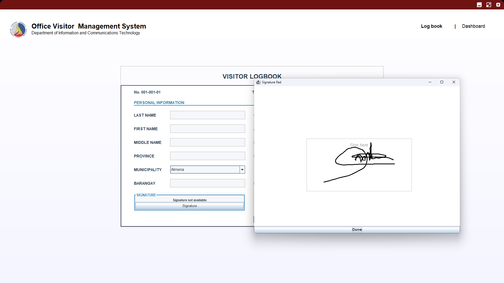
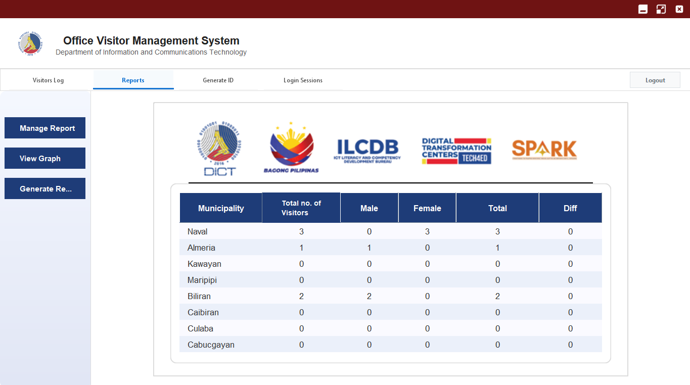
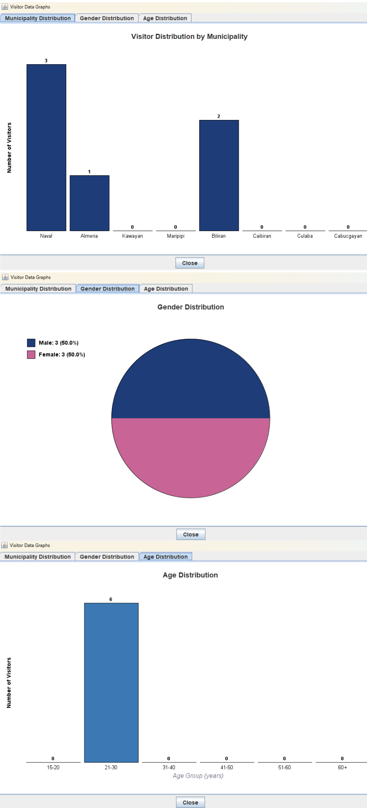

# Implementation of Office Visitors Management System for Department of Information and Communications Technology (DICT) - Biliran

## Project Description
The Office Visitors Management System (OVMS) is a digital solution developed for the Department of Information and Communications Technology (DICT) Biliran to replace the traditional handwritten logbook system. The system improves visitor tracking by providing a faster, more secure, and more organized way of recording visitor information.

This project aims:
1. To design and develop the OVMS tailored for DICT Biliran.
2. To replace manual logbooks with a digital visitor registration system.
3. To implement a secure admin dashboard for managing and monitoring visitor data.

## Screenshots

### Visitors Logbook

### Admin Reports

### Distributions

## Features
- Digital visitor registration system
- Photo capture integration
- Signature recording
- Secure admin dashboard
- Visitor log management
- Visitor ID generation

## System Workflow
1. Visitor inputs personal details
2. System captures photo and signature
3. Data is stored in MySQL database
4. Admin accesses dashboard to view and manage records
5. Visitor ID can be generated if required

## System Requirements
### Hardware
- Desktop or laptop computer (check-in station)
- Camera (for visitor photo capture)

### Software
- Java (Frontend and Backend development)
- MySQL Workbench (Database management and storage)
